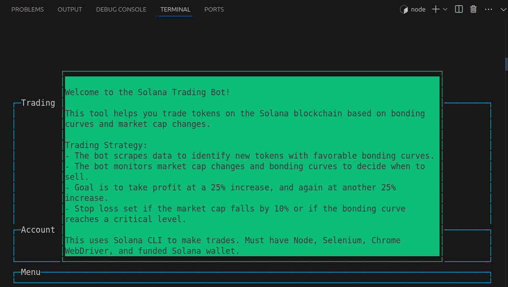
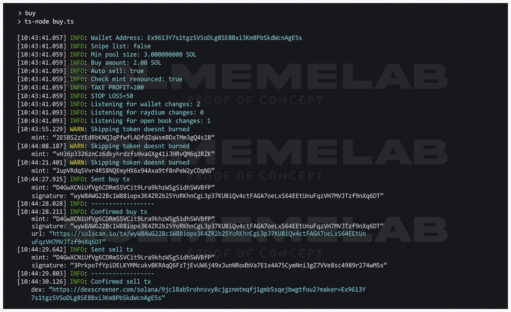

## Pump.fun Solana Trading and Sniping Bot

Copyright © Diveinprogramming

1 npm install 

2 Load .env file 

3 node main.mjs 

4 Enjoy profit 

5 Support if you want 

Welcome to the Pump.fun Zero Fee Solana Trading Bot! This tool, developed by Diveinprogramming, is designed for trading and sniping new token launches on pump.fun. It includes strategies for buying and selling tokens based on market cap changes and bonding curve progress.

## Overview

The Solana Trading Bot helps you trade tokens on the Pump.fun on Solana blockchain based on bonding curves and market cap changes. The bot scrapes data to identify new tokens with favorable bonding curves, monitors market cap changes, and makes decisions on when to sell to maximize profits.

## Trading Strategy

- **Initial Buy**: The bot scrapes pump.fun to identify new token pairs with favorable bonding curves.
- **Monitoring**: Once a token is bought, the bot monitors the market cap and bonding curve progress.
- # **Profit Targets**:
- **Profit Targets**:
  - The bot aims to take profit at a 25% increase and then again at another 25% increase.
  - It sells 50% of the tokens at the first 25% increase and 75% of the remaining tokens at the next 25% increase.
- **Stop Loss**: The bot will sell all tokens if the market cap falls by 10%.
- **Bonding Curve**: The bot will sell 75% of the tokens if the bonding curve reaches a critical level and keep 25% as a moon bag.
- **Timing**: The bot resets the timer if the price goes up and monitors the trade for a set period, adjusting its actions based on market conditions.

## Requirements

- **Node.js**: JavaScript runtime built on Chrome's V8 JavaScript engine.
- **Solana CLI**: Command-line interface for interacting with the Solana blockchain.
- **Selenium WebDriver (Chrome)**: Automated web browser.

## Installation

1. **Download zip from repository**:
   git clone  https://github.com/Diveinprogramming/pumpfun-sniping-bot.git
   
   cd solana-trading-bot

3. **Install dependencies**:
   \`\`\`sh
   npm install dotenv axios @solana/web3.js @solana/spl-token selenium-webdriver nodemailer fs bs58 blessed blessed-contrib

   \`\`\`

4. **Set up your environment variables**:
   Create a .env file in the root directory and add the following:
SOLANA_WALLET_PATH=/path/to/your/solana/wallet.json
MINIMUM_BUY_AMOUNT=0.015
MAX_BONDING_CURVE_PROGRESS=10
SELL_BONDING_CURVE_PROGRESS=15

5. **Configure Solana CLI**:
   \`\`\`sh
   solana config set --url https://api.mainnet-beta.solana.com
   solana config set --keypair /path/to/your/solana/wallet.json
   \`\`\`

## Usage

- **Run the trading bot**:
  \`\`\`sh
  node main.mjs
  \`\`\`

- **Sell all SPL tokens**:
  \`\`\`sh
  node sell.js
  \`\`\`

## Donations

If you find this tool useful, please consider supporting the developer. Donations can be sent to:

- Solana Address: 3vvnenyjwicBq3WEdQQNGMnaodHXBzSPubdhoBP3YA3N

## About

This tool is developed by Diveinprogramming. It is designed to help traders effectively manage their trades on the Solana blockchain, especially for new token launches on pump.fun. The bot keeps moon bags and times trades efficiently to maximize profits and minimize losses.

## keywords
pump.fun | pumpfun | pump-fun | trading | sniping | snipper | jito tip | jito bundle | auto buy sell | low fees | bot | solana | secure | audit | sniper | pumpfun-bot |  web scraper | 100x | github | telegarm | copy trading | insider wallet |  moonshot bot |  make money | buy tracker bot | micro buy | memecoin | meme coins | pump dump |  ai bot | 

## Disclaimer

Use this tool at your own risk. Trading cryptocurrencies involves significant risk and can result in the loss of your capital. Always do your own research before making any trading decisions.

Thank you for using the Solana Trading Bot! Happy trading!

Diveinprogramming
